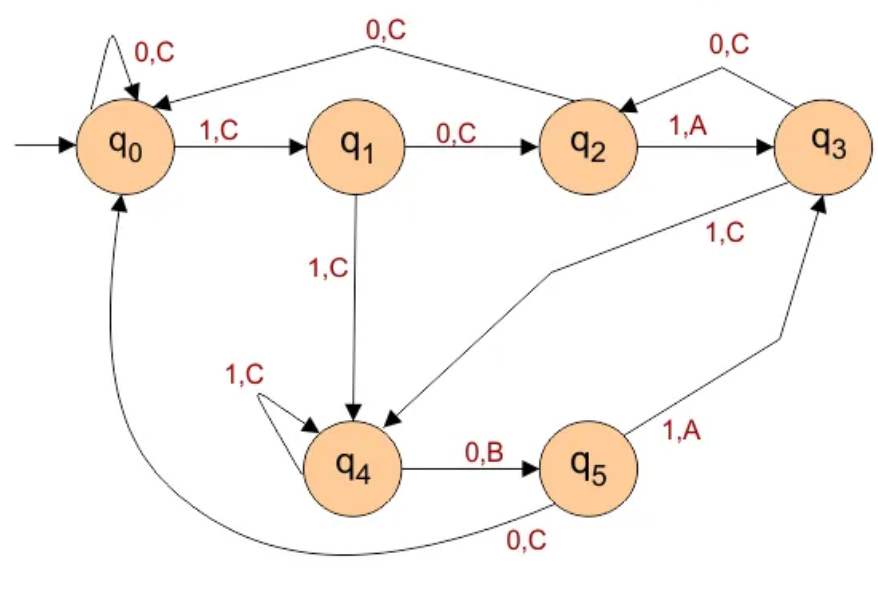
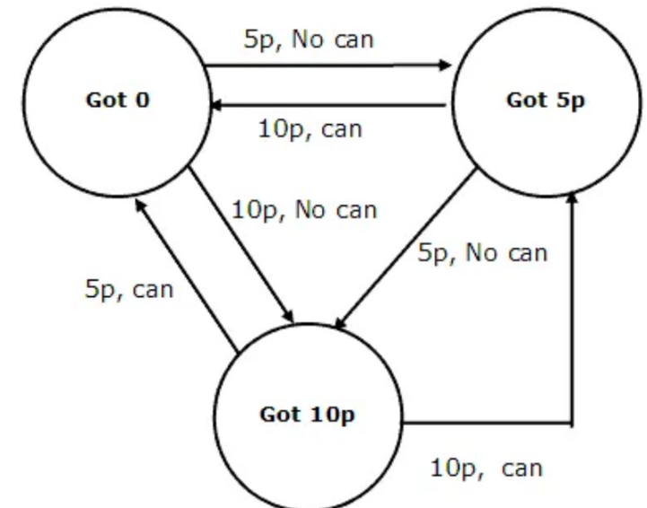
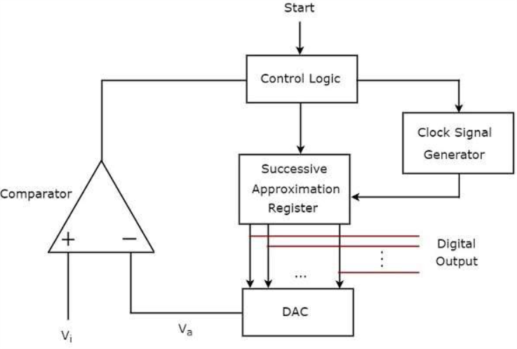
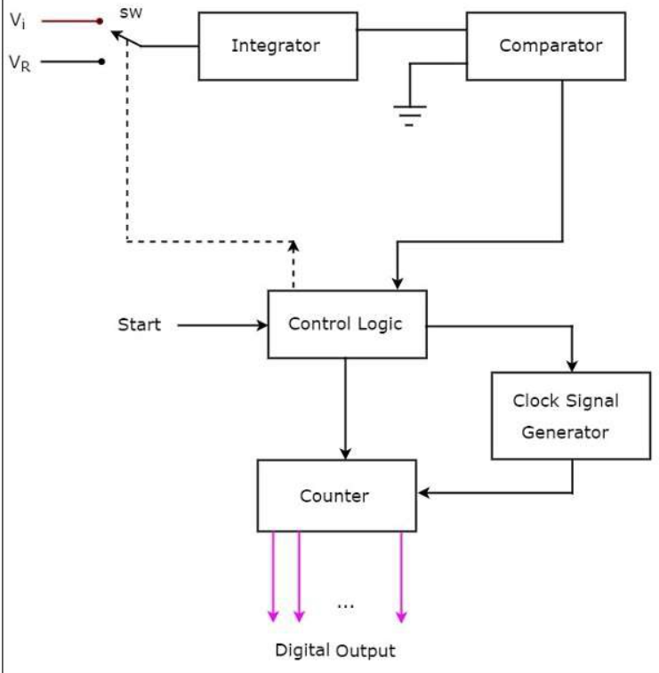
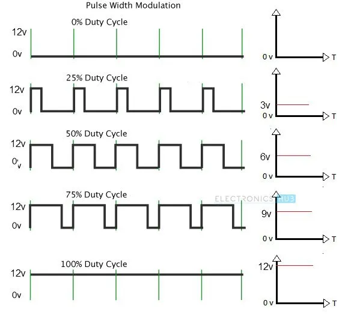

# ER101
## Hello everyone, and welcome to ER 101!

Have you ever been amazed by how electronics actually work? Like, how are phones, laptops, or robots even possible? It’s crazy to think that something as small as moving electrons and electric fields somehow powers all the tech we use every day — from gaming and social media to automation and AI.

It almost feels like magic… but it’s not. It’s science — and humans figured it out.

So, where do you begin if you want to really understand how computers and electronics work? Right here.

The Electronics and Robotics Club of IIT Bombay brings you ER 101 — a beginner-friendly roadmap to help you build a solid foundation in electronics and get a clear picture of how we use electricity to process information and build the tech around us.

---

 #### *We’re starting from the absolute basics, so feel free to skip around or move ahead — take it at your own pace.*
 
---

### To kick things off, here’s an excellent playlist that covers the fundamentals of digital electronics.
We’ll be referring to specific video numbers from this playlist throughout our journey in ER 101, so I highly recommend going through it as we progress. It’s genuinely one of the most well-structured and informative resources out there.

[▶️ Link to the Playlist](https://youtube.com/playlist?list=PLwjK_iyK4LLBC_so3odA64E2MLgIRKafl&si=oMMceoZ6F5fteiB8)

This playlist is an absolute goldmine — don’t overlook it. It’ll make a big difference in how clearly you understand the concepts ahead.

---

### Here’s another great resource to explore digital electronics.
If you prefer reading over videos — or want to explore certain topics in a different format — this GeeksforGeeks resource is a great alternative.

[📚 Digital Electronics Articles on GeeksforGeeks](https://www.geeksforgeeks.org/digital-electronics-logic-design-tutorials/)

It’s well-structured, beginner-friendly, and covers a wide range of topics in digital electronics. Definitely worth exploring if you enjoy learning by reading.

---

### 🔌 Try It Yourself — Simulations for Hands-On Practice

We’ll guide you through the concepts in this course, but if you *really* want to understand how things work, you’ve got to try them out yourself.  
Here are some platforms where you can experiment and build your own circuits:

---

#### 🧠 For Digital Logic Circuit Simulation

- 🔗 [**CircuitVerse**](https://circuitverse.org)  
  **CircuitVerse** is an online simulator designed for building and testing digital logic circuits. It’s perfect for experimenting with logic gates, flip-flops, multiplexers, and more — all in a visual, beginner-friendly environment.

  

---

#### ⚙️ For Real-World Electronics & Arduino Simulation

- 🔗 [**Wokwi**](https://wokwi.com)  
  Wokwi is a powerful browser-based simulator for **Arduino**, ESP32, Raspberry Pi Pico, and more. It lets you build and test embedded systems with real-world components like sensors, displays, and microcontrollers — all without any hardware. Great for prototyping, debugging, or just learning how things work.

  

- 🔗 [**TinkerCAD Circuits**](https://www.tinkercad.com/circuits)  
  **TinkerCAD** Circuits is a beginner-friendly online tool that lets you simulate basic electronics and **Arduino** projects. It’s simple, intuitive, and great for quickly testing ideas or learning how circuits work — no hardware needed

  

---

## 🔌 What is Digital Electronics?
Digital electronics is the part of electronics that deals with systems using digital signals — signals that can only be 1 (high) or 0 (low).

Why just two values? Because it makes things much more reliable. Unlike analog signals that can be messy and affected by noise, digital signals are clear and easy to work with — which is why almost all modern devices like phones, laptops, and calculators are built using them.

  
📼  *Video 1 in the playlist*
---

## 1. The Language of Digital Electronics: Binary
In digital electronics, everything comes down to 0s and 1s — they represent the low and high signals in a circuit. That’s why it’s important to understand the binary number system early on. Computers and digital devices store and handle all kinds of data — numbers, text, images — using just these two values. So, if you want to really get how digital systems work, binary is where it all begins.

Here are some great resources to get you started :
- [Number Systems and Base Conversions](https://www.geeksforgeeks.org/number-system-and-base-conversions/)  
  Understand binary, decimal, octal, and hexadecimal systems — and how to convert between them.

- [Binary Arithmetic](https://www.geeksforgeeks.org/binary-number-system/)  
  Learn how addition, subtraction, and multiplication work in binary.

- [2’s Complement and Signed Representation](https://www.geeksforgeeks.org/binary-representations-in-digital-logic/)  
  Explore how negative numbers are handled using 1’s and 2’s complement.'

📼 **Relevant Videos:** *Videos 2–15 in the playlist*

- [🧠 IEEE 754 — How Do Computers Store Decimal Numbers?](https://www.geeksforgeeks.org/introduction-of-floating-point-representation/)

📼 **Relevant Videos:** *Videos 25–29 in the playlist*

---

### 🎯 Side Quest (Optional, but Super Cool)

Want to go a bit deeper or explore some bonus topics? These are not mandatory, but definitely fun to look into:

- **Gray Code, XS-3, BCD**  
  → [BCD](https://www.geeksforgeeks.org/bcd-or-binary-coded-decimal/)
    Represents each decimal digit separately in 4-bit binary. Easy to read, used in displays.
  
  → [XS-3](https://www.geeksforgeeks.org/excess-3-code/)
    Adds 3 to each digit before converting to binary. Helps avoid negative values in circuits.
  
  → [Gray Code](https://www.geeksforgeeks.org/what-is-gray-code/)
    Only one bit changes between consecutive numbers. Reduces errors in sensors and encoders.
  
    📼 *Videos 17–29 in the playlist*
  

- **Hamming Code (Error Correction)**  
  [Hamming Codes](https://www.geeksforgeeks.org/hamming-code-in-computer-network/) Learn how data can be checked and corrected — used in memory systems, communication, and more.  
  📼 *Videos 20–24 in the playlist*

---

## 2. ⚙️ Intro to Logic Gates & Boolean Algebra

Let’s start with the real basics of digital electronics **— logic gates**.

Any complex operation a computer performs can be broken down into smaller logical steps. That’s exactly what Boolean algebra helps us do — describe and simplify these steps using logic.

Logic gates are the physical building blocks that implement this logic. Just like atoms make up all matter, logic gates form the core of all digital processes.

Understanding them is the first step to understanding how our technology really works.

---

### Logic Gates
- **AND**, **OR**, and **NOT** are the basic gates — everything in digital logic builds off of these. Then we’ve got **NAND** and **NOR**, known as universal gates because you can create any other gate using just one of them. Pretty interesting, right? Let’s check them out.

  [🔗 Explore Basic & Universal Gates](https://computerengineeringforbabies.com/blogs/engineering/logic-gate/)
  
  📼 *Videos 30–34, 49 and 51 in the playlist*

#### CMOS Logic Gates
We also take a quick peek under the hood to see how logic gates are actually built using transistors. Understanding the physical side — how these abstract logic blocks are made real — is pretty cool and helps make sense of how digital electronics work at the lowest level.  

- [CMOS Logic Gates](https://www.geeksforgeeks.org/cmos-logic-gate/)
  
📼 *Video 173* — How logic gates are built using complementary MOSFETs in CMOS technology.  

Not familiar with how a MOSFET works? Here are some quick tutorials to get you up to speed:

* [Intro to MOSFETs](https://www.circuitbread.com/tutorials/how-a-mosfet-works-at-the-semiconductor-level) — Basics of how MOSFETs function.

* [NMOS vs PMOS Comparison](https://www.circuitbread.com/tutorials/nmos-vs-pmos-and-enhancement-vs-depletion-mode-mosfets) — The two types of MOSFETs and how they differ.

---

### 🧠 Boolean Logic

Once you’ve got a grip on individual logic gates, the next step is learning how to represent and simplify more complex logic using Boolean algebra. This helps make your circuits cleaner, faster, and more efficient.

- **[Boolean Algebra & Laws](https://www.geeksforgeeks.org/boolean-algebra/)**  
  Learn the core rules and operations (like AND, OR, NOT) that help describe and manipulate logic expressions. These laws form the foundation for all logic simplification.
  
  📼 *Videos 35, 37*

  

- **[SOP](https://www.geeksforgeeks.org/what-is-sum-of-product-sop-form/) | [POS](https://www.geeksforgeeks.org/what-is-product-of-sum-pos-form/)**  
  When writing Boolean expressions, there are two common formats — Sum of Products (SOP) and Product of Sums (POS). In SOP, you combine multiple ANDed terms using OR, while POS does the opposite by combining ORed terms using AND. These formats aren’t just theoretical — they’re incredibly useful when designing actual logic circuits, especially when it comes to optimization and simplification later using tools like K-Maps.
  
  📼 *Video 53*

- **[K-Maps & Minimization](https://www.geeksforgeeks.org/k-mapkarnaugh-map/)**  
  Karnaugh Maps (or K-Maps) are like cheat sheets for simplifying Boolean expressions. Instead of writing out a truth table and using algebra, you just group 1s or 0s on a grid. It’s a visual method that quickly helps reduce logic circuits into simpler versions with fewer gates.
Once you get used to it, this becomes your go-to technique when circuits start looking messy or redundant.

  📼 *Videos 57–61*

  

- **[Don't Care Conditions](https://www.geeksforgeeks.org/dont-care-x-conditions-in-k-maps/)**  
  Sometimes, certain input combinations are either invalid or won’t occur in a real-world use case. These are called “don’t care” conditions, and they’re marked as 'X' in K-Maps.
The cool part? You can use these Xs however you want — either as 1 or 0 — to help you create larger groups and simplify your expressions even more.

  📼 *Video 62*

- **[Quine-McCluskey (Optional)](https://www.geeksforgeeks.org/quine-mccluskey-method/)**  
  Think of this as a more systematic, step-by-step way of minimizing Boolean expressions — perfect for writing logic simplification algorithms that computers can use.
While it’s not something you’ll always use by hand, knowing how it works helps when dealing with larger circuits where K-Maps get impractical. Great for those who want to dive deeper or are curious about how logic simplification is automated.

---
## 3.  ⚙️ Combinational Circuits

Let’s level up our logic. Using our understanding of basic gates, we now start building more complex circuits — the kind that actually do stuff. Combinational circuits are the next step: they don’t use any memory, which means their output depends only on the current inputs, nothing more. In this section, we’ll explore how simple gates can be combined to form higher-level blocks like adders, multiplexers, and comparators — circuits capable of performing real calculations and decision-making. It’s like upgrading from individual Lego bricks to full structures.

---

### ➕ Adders
Okay, first up — let’s build circuits called adders.
As we’ve learned about binary addition, it’s time to start building circuits that can actually add. Just imagine — a bunch of transistors, wired up and flowing with electricity, somehow doing math! They’re helping us add two numbers. Sure, it’s all in binary and we don’t get to see the satisfying decimal answers just yet… but don’t worry. With some more circuitry, it will all add up 😉.

- **[Half Adder](https://www.geeksforgeeks.org/digital-electronics-half-adder/)**  
  This is the most basic adder circuit — it takes in two single-bit binary inputs and gives you a sum and a carry. No carry-in here, just a simple intro to how logic gates can literally "add." It’s made using just an XOR and an AND gate. Pretty neat for something so simple.

  

- **[Full Adder](https://www.geeksforgeeks.org/full-adder-digital-electronics/)**  
  The full adder builds on the half adder and adds one more input: the carry-in. So now it can actually be used to add multi-bit numbers by chaining multiple full adders. This one’s essential for any real arithmetic in digital systems.

  
  

- **[Ripple Carry Adder](https://www.geeksforgeeks.org/parallel-adder-and-parallel-subtractor/)**  
Now that we’ve got full adders, we can connect them in series to add multi-bit binary numbers. That’s exactly what the ripple carry adder does. Each full adder handles a bit of the numbers and passes its carry to the next. It’s simple and easy to build — but as the name suggests, the carry "ripples" through each stage, which slows things down when dealing with lots of bits. Great for learning, not ideal for speed.

- **[Carry Look Ahead Adder](https://www.geeksforgeeks.org/digital-logic-carry-look-ahead-adder/)**  
  To fix the delay caused by ripple carry, we use a smarter design — the carry look ahead adder. Instead of waiting for the carry to travel through each adder, this circuit predicts it using logic based on the input bits. It uses the concepts of generate and propagate to compute all carries in parallel. That makes it way faster and far more efficient, especially in real-world CPUs. It’s a great example of how we trade off complexity for performance in circuit design.

  📼 *Videos 67–71*

  

- **[BCD Adder (Optional)](https://www.geeksforgeeks.org/digital-electronics-bcd-adder/)** | [📺 Video](https://www.youtube.com/watch?v=ss9FpyRgIjw)  
  Remember BCD? (Yeah, the one where we awkwardly fit decimal digits into 4-bit binary.) Now let’s try designing an adder that can handle numbers in that exact format. It’s a bit different from normal binary addition, but super useful in things like calculators and digital clocks where we actually care about decimal digits.

---

### ✖️ Multipliers

Alright — we’ve tackled addition, so next up is multiplication. Sounds straightforward, right? And yeah, conceptually it is: multiplying binary numbers is just repeated addition. But when it comes to the actual circuits... yeah, they can look pretty scary at first glance 😵‍💫.

But don’t worry — the core idea is still simple, and once you break it down, it's totally manageable. The videos do a great job walking through it, and I really recommend grabbing a pen and actually drawing out the circuit step by step. You’ll appreciate how the logic unfolds bit by bit(yep, pun intended 😏).  

📼 *Video 75 (Signed → 76 (signed multiplication is optional)*  

   
  
##### *P.S. Don’t worry — once you learn a bit about sequential circuits, we’ll be able to build a much more efficient (and slightly smaller!) circuit for binary multiplication*
---

#### ➖ Subtractors & Dividers
We’ve done addition and multiplication — so why stop there? Let’s cover the full set of basic operations. Subtractors and dividers aren’t always covered in depth, but they’re definitely worth checking out if you're curious about how binary subtraction and division work in hardware. Not strictly necessary, but definitely a fun dive!
- [Subtractor](https://www.geeksforgeeks.org/digital-logic/full-subtractor-in-digital-logic/)
- Divider (Sorry we dont have a reading resource for this)
  
📼 *Video 75, 85* 

---

### 🔁 Comparator
Alright — we’ve done addition, subtraction, and multiplication. Now let’s look at something a bit different: comparison. Sometimes you don’t want to calculate a value, you just want to know which number is bigger. That’s where comparators come in. A magnitude comparator takes in two binary numbers and tells you if one’s greater than, less than, or equal to the other. Pretty straightforward, but super important in decision-making circuits.  

**[Read More Here](https://www.geeksforgeeks.org/magnitude-comparator-in-digital-logic/)**  
  📼 *Video 78*

---

### 🎛️ MUX, DEMUX, Encoders & Decoders

Now let’s look at some basic but powerful logic circuits that act more like managers than calculators. These circuits don’t directly compute values, but they control how data flows in more complex systems. Whether it’s selecting inputs, routing outputs, or translating data formats, these blocks play a huge role in organizing and directing the logic inside a digital system. You'll see them pop up all over the place later on, so it's worth getting comfortable with them now.

- **[Multiplexers & Demux](https://www.elprocus.com/what-is-multiplexer-and-demultiplexer-types-and-differences/)**  
  Now let’s look at some logic circuits that aren’t doing calculations themselves, but are super useful for controlling where data goes. These are things like MUX, DEMUX, encoders, and decoders — they help manage inputs and outputs in bigger systems, and you’ll see them show up a lot as we go forward.  

   

- **[Encoders & Decoders](https://www.geeksforgeeks.org/digital-logic-encoders-decoders/)**  
  Now let’s look at encoders and decoders — circuits that don’t really compute anything but are super useful when you need to convert data from one format to another. An encoder takes multiple inputs and compresses them into a smaller set of outputs, while a decoder does the opposite — it expands coded data into a more readable form. You'll see these often when dealing with memory, displays, or instruction sets.  

   
  📼 *Videos 79–90* (skip 85)

---
## 4. ⏱️ Sequential Circuits
Until now, we’ve explored combinational circuits — where outputs depend only on the current inputs. But real-world tasks often need memory. Think about it: in many everyday tasks, each step depends on what happened just before. You can’t always make decisions based only on the present; sometimes the past matters too. That’s where sequential circuits come in. These circuits have a memory element, meaning their output depends on both current inputs and past states. Pretty cool, right? Let’s dive in!    

- [Intro to Sequential Circuits](https://www.geeksforgeeks.org/introduction-of-sequential-circuits/)
  
  
  📼 *Video 91*

---

### Latches and FlipFlops
First things first — you might be wondering, how do we even store data? How can a digital circuit remember anything?
Surprisingly, with just a clever arrangement of the basic logic gates we already know, it’s possible to build a circuit that holds on to its previous value. That’s the most fundamental unit of memory in digital electronics — the latch.

And when we make a few improvements to handle timing more reliably, we get the flip-flop — a more stable and practical memory element.

With just these two basic building blocks, we can create all sorts of memory-based circuits. So let’s dive in and see how they work!

- [Latches](https://www.geeksforgeeks.org/latches-in-digital-logic/) – These are the simplest memory elements in digital electronics that can store a single bit of data by feeding the output back into the input using logic gates.

  

  
- [Flip-Flops](https://www.geeksforgeeks.org/flip-flop-types-their-conversion-and-applications/)– These are clock-controlled memory elements that store one bit of data and are more stable and reliable than latches, making them the building blocks of most sequential circuits.

  

- [Master-Slave Flip-Flop](https://www.geeksforgeeks.org/master-slave-jk-flip-flop/) – a setup where two flip-flops are connected in series: the master captures input when the clock is low, and the slave updates the output when the clock goes high. This separation helps eliminate glitches and ensures clean, synchronized output transitions.

  📼 *Videos 92–117*
  
---
### Registers 

Okay, storing a single bit is cool and all — but let’s be real, that’s not going to take us very far. What we really want is to store multiple bits, and that’s exactly what registers are for.

At their core, registers are just a bunch of flip-flops lined up next to each other, working together. Depending on how we connect them, we get different types of registers like PIPO, PISO, SISO, SIPO, and the universal register.

Sounds a bit confusing? Don’t worry — it’s not as bad as it seems. Here's a quick breakdown:

- **P/S** stands for **Parallel/Serial** — parallel means all bits move at once, serial means one at a time.

- **I/O** just means **Input/Output**.

- And a **universal register** is like an all-rounder — it can handle everything.

With just this info, you can actually try building a simple register yourself! But if you want to understand it properly, here’s a solid resource:  

* [Register Circuits (PIPO, SISO, etc.)](https://www.geeksforgeeks.org/shift-registers-in-digital-logic/)

  📼 *Videos 119–124*

---

### ⏲️ Synchronous vs Asynchronous

While exploring sequential circuits, you might’ve noticed that most of them rely on something called a clock — a timing signal that tells the circuit when to do things. Based on how this clock is used, we classify sequential circuits into two types: synchronous and asynchronous.

In synchronous circuits, all components work in sync with a single, global clock. Every operation happens only when that clock ticks — making the behavior predictable and easier to design and debug.

In asynchronous circuits, there's no global clock. Circuits operate as soon as inputs arrive, meaning outputs might appear at different times. This makes them faster, but also trickier to design and more prone to glitches or timing errors.

Here’s a bit more if you want to dive into the details:
- [Synchronous Circuits](https://www.geeksforgeeks.org/synchronous-sequential-circuits-in-digital-logic/)
- [Asynchronous Circuits](https://www.geeksforgeeks.org/asynchronous-sequential-circuits/)

---
### 🧮 Counters
Let’s look at a super important use case of sequential circuits — counters. These circuits keep track of the number of clock pulses and are used pretty much everywhere: timers, clocks, memory, and even state machines. It’s also a great example to understand the difference between synchronous and asynchronous designs in action. Let’s break it down.
- [Overview](https://www.geeksforgeeks.org/counters-in-digital-logic/)  
 Counters are circuits that count clock pulses. Sounds simple, right? But they’re actually super useful in everything from timers to memory addressing. Think of them like digital tally marks that increase with every clock tick.
- [Ripple Counters](https://www.geeksforgeeks.org/ripple-counter-in-digital-logic/)  
  This is the simplest form of a counter and an example of an asynchronous counter. The flip-flops don’t all get the clock at the same time — instead, the output of one becomes the clock for the next. This creates a ripple effect (hence the name), which makes them easier to build but slower and prone to glitches due to the delay.

  
- [Ring & Johnson Counters](https://www.geeksforgeeks.org/n-bit-johnson-counter-in-digital-logic/)  
  These are examples of synchronous counters, where all flip-flops receive the same clock signal. Ring counters circulate a single '1' (or '0') around, and Johnson counters are a modified version that doubles the number of states by feeding the inverted output back. They’re more stable and predictable — great for specific sequencing tasks.

  
- [Sequence Design](https://www.geeksforgeeks.org/design-counter-given-sequence/)  
  Sometimes we want counters to follow a custom pattern — say 0 → 3 → 5 → 2 → 7. That’s where sequence design comes in. You’ll learn to design state diagrams and choose the right flip-flops to build exactly the sequence you want. It’s a good test of your understanding of everything you’ve learned so far!

---
## 5. 🧠 Finite State Machines
Okay, we’ve looked at all sorts of logic circuits — but now we want to go one step further. We want to build circuits that actually do something we want, like follow a set of rules or perform a specific task. But where do we even start? How do we take a process that exists in our head and turn it into a working logic circuit?

That’s where Finite State Machines (FSMs) come in. They're a super useful concept that help us bridge the gap between an abstract idea and a real digital circuit. Think of FSMs as a blueprint for behavior — if you can take any process or logic you’re imagining and express it as an FSM, turning it into a digital circuit becomes surprisingly straightforward. 

In a Finite State Machine, as the name suggests, there are a finite number of states. The machine moves between these states based on the input it receives — but how exactly it gives output depends on the type of FSM you're using.
* **Mealy FSM:**  
In this type, the output depends on both the current state and the input. That means the machine can respond faster to inputs since the output can change as soon as the input changes.

* **Moore FSM:**  
Here, the output depends only on the current state. So even if the input changes, the output won’t change until the FSM transitions to a different state. It’s a bit slower to react, but often simpler to design and debug.

- 📄 [Understanding Finite State Machines](./resources/Intro_to_FSM.pdf)  

  
    

Lets look at a simple and the most widely used example of an FSM
- 📄 [FSM – Vending Machine](./resources/Vending_Machine_FSM.pdf)  

📼 *Videos 187–202* (skip 188)

---

#### Some Extra stuff
These are more compact and efficient versions of some combinational circuits we explored earlier. They’re optional, but good to know!
- [Serial Binary Adder](https://www.geeksforgeeks.org/serial-binary-adder-in-digital-logic/)
- [Sequential Binary Multiplier](https://www.geeksforgeeks.org/sequential-binary-multiplier/)  
📼 *Videos 203–205*

---
#### *You can always try making all these logic circuits in the online simulator given.*
---
##   🔌 Analog Circuits
Now that we’ve looked at digital circuits, let’s take a moment to explore the world of analog circuits and understand how they work.
Yes, modern tech is mostly built around digital systems — but that doesn’t mean analog circuits are useless. In fact, they’re everywhere! While your CPU might be fully digital, things like touchscreen sensors, audio input/output, battery charging, power management, camera modules, and signal modulation still rely heavily on analog circuitry.

So to really make the most of technology, we need to understand and use both analog and digital circuits together.

I'm going to assume you already have some basic knowledge of common circuit components — like resistors, capacitors, and inductors — from high school physics. Also, a basic understanding of how a BJT (Bipolar Junction Transistor) works will be really helpful. If you’re feeling a bit rusty on any of these, I highly recommend brushing up, since these are the core elements we’ll be working with in analog circuits.

---
## 6. Analog Building Block: Op-Amps
Op-Amps (Operational Amplifiers) are among the most fundamental and powerful building blocks in analog electronics. These little devices can amplify tiny signals, filter out noise, compare voltages, and even perform mathematical operations like addition and integration — all using just a few external components. You’ll find them everywhere: in sensor circuits, audio systems, analog-to-digital converters, and power management systems. Once you understand how Op-Amps work, you unlock the ability to design a wide range of analog circuits.

    
  

[🔗 Op-Amp Fundamentals & Essential Circuits](https://www.tutorialspoint.com/linear_integrated_circuits_applications/linear_integrated_circuits_applications_basics_of_operational_amplifier.htm)  
This is  a solid reading resource that explains the basics of Op-Amps along with all the important configurations you should  know. I suggest going through it at least till the comparator section, which includes the core topics like inverting, non-inverting, summing, difference, voltage-to-current, current-to-voltage, differentiator, and integrator. These are all fundamental to analog circuit design.  

▶️ [Op-Amp Video Playlist](https://youtube.com/playlist?list=PLwjK_iyK4LLDBB1E9MFbxGCEnmMMOAXOH)  
This is a YouTube playlist that will arm you with everything you need to know about Op-Amps — from the basics to practical applications. Super useful if you prefer learning by watching.  

#### *How does an op-amp look in real life? How is it used?*
#### *Figure it out and try building the op-amp circuits in the simulator.*
---
## 7. ADC / DAC 101
Now, if we’re using both analog and digital circuits together, we obviously need a way for them to talk to each other. That’s where signal conversion comes in. To convert analog signals into digital (so digital circuits can understand them), we use an Analog to Digital Converter (ADC). And to go the other way — digital signals back into analog — we use a Digital to Analog Converter (DAC).

These two are super important bridges between the analog and digital worlds.  

---

### **Digital to Analog Converters (DAC)**
DACs are circuits that take binary input and convert it into a corresponding analog voltage signal.

There are mainly two common types we’ll look at:  
- **🪵 Binary Weighted Resistor DAC**  
Each bit is connected to a resistor weighted based on its position — higher bits get smaller resistors and contribute more to the output. Simple to understand, but not super practical for large bit sizes since it needs very precise resistor values.  

- **🪜 R–2R Ladder DAC**  
This one just uses two resistor values: R and 2R. The resistors are arranged like a ladder and give accurate output while being way easier to build and scale. Much more practical for real-world applications.  
  

---
### **Analog to Digital Circuits (ADC)**
ADCs do the opposite of DACs — they take an analog voltage and convert it into a binary number that a digital system can understand.

Let’s look at some common types of ADCs, each with its own way of approaching the problem:

- **🧮 Counter-Type ADC**  
This one starts at zero and counts up until the DAC output matches the input analog voltage. It’s simple but slow — has to go through all values one by one.

- **🎯 Successive Approximation ADC**  
A much smarter approach — it guesses the binary number bit by bit, starting from the MSB. Fast and commonly used in microcontrollers because of its efficiency.

- **⚡ Flash ADC**  
The fastest of them all — it uses a ton of comparators to instantly determine the binary output. Super fast, but also takes up a lot of space and power. Used when speed really matters (like high-speed video or data).

  

- **🐢 Dual Slope ADC**
It integrates the input over time and compares it with a reference. Very accurate and stable, especially useful in digital multimeters. Not fast, but super reliable.

    
---

That was just a quick preview — here are some solid resources to fully understand how ADCs and DACs work:  

[📄 Understanding ADCs & DACs](https://www.ee.iitb.ac.in/~sequel/ee101/ee101_dac_1.pdf)  
Here are some lecture slides that clearly explain the different types of ADCs and DACs, and how each of them works.  

[🎥 Complete Guide to ADCs & DACs](https://youtube.com/playlist?list=PLwjK_iyK4LLCnW-df-_53d-6yYrGb9zZc&si=rnaJttZ3t-601D9t)  
This playlist covers everything you need to know about converting between analog and digital signals. It walks you through the working of various ADCs (like successive approximation, flash, dual slope) and DACs (like R-2R ladder and weighted resistor). This is definitely something you’ll want to check out.

#### *Maybe you can try making some of the simpler circuits in the simulator?*
---

## 8. The 555 Timer IC
Now let’s look at a very famous IC that’s widely used across tons of circuits — the 555 Timer IC. What’s cool is that it combines both digital and analog elements, and it’s mainly used to generate precise timing signals. From blinking LEDs to PWM control and delay circuits, its applications are endless. Let’s dive in and see what makes this chip so iconic.

 **THE INTERNAL CIRCUIT OF 555 TIMER IC**

 

The 555 Timer is a widely used IC that cleverly combines analog and digital components — like two comparators, a flip-flop, and a discharge transistor — into one compact chip. It’s designed to generate accurate time delays or oscillations using just a few external components.

At the heart of its timing mechanism is a capacitor. The idea is simple but powerful: capacitors charge and discharge at a predictable rate depending on the surrounding resistor values. The internal comparators in the 555 monitor the voltage across this capacitor. When the voltage crosses certain thresholds (typically 1/3 and 2/3 of the supply voltage), they trigger the flip-flop to change the output state and optionally discharge the capacitor via an internal transistor.

This clever cycle of charging and discharging allows the 555 Timer to act in different modes — monostable (one-shot pulse), astable (square wave generator), or bistable (flip-flop behavior). It’s incredibly versatile and still used in all kinds of circuits, from blinkers to audio tones to sensor triggers.

If you want a visual breakdown of how it all works and its basic applications, check out this Videos 10-13 of this handy playlist:  
[🎥 555 Timer IC — Explained & Applications](https://youtube.com/playlist?list=PLwjK_iyK4LLCVdgBR30pSFVj-17TI_8ou)  

#### *Try to simulate the applications of the timer on the simulator and have fun*
---

## 9.  ⚡ Pulse Width Modulation (PWM) — A Practical DAC Alternative

While Digital to Analog Converters (DACs) give precise analog outputs, they can be expensive and sometimes not practical for simpler tasks. That’s where PWM (Pulse Width Modulation) comes in — a clever and cost-effective alternative.

Instead of generating a smooth analog signal directly, PWM rapidly switches the output between high and low voltages. By adjusting the duty cycle — the proportion of time the signal stays high versus low — we control the average output voltage.

It’s widely used in motor speed control, LED dimming, audio modulation, and many embedded applications where simple, efficient analog output is needed.

Here’s a quick overview of what PWM is and an intuition on how it works:  
[Understanding PWM (Pulse Width Modulation)](https://www.youtube.com/watch?v=ISzRh5eN_Pg)

Here are some more resources to help you understand PWM better:  
- [📄 Reading Resource](https://www.geeksforgeeks.org/pulse-width-modulation-pwm/)

- [📺 Video Explanation](https://www.youtube.com/watch?v=2XjqS1clY_E)

Hmm yes, this is useful — but how do we even generate such accurate signals, you might be wondering?
Turns out, it’s not that hard. If you remember the 555 timer configured as an astable multivibrator, it's pretty much the same circuit! Just swap out some of the resistors with a potentiometer, and voilà — you can control the duty cycle and get a precise PWM signal.  
[👉 Watch this tutorial on building a 555 PWM circuit](https://www.youtube.com/watch?v=x4RmIzUd2lk)— and I suggest you try building this circuit in an online simulator too!

---
**🎉 YAYY! You made it through the basics of electronics!**  
Now we can finally move forward to understanding mini computers — yep, I’m talking about microcontrollers. You’ve built a pretty solid foundation in all the core concepts.

Sure, the first part was a bit theory-heavy... but don’t worry — from here on out, as we dive into microcontrollers (especially with something like the Arduino board), everything becomes way more hands-on and practical.
No more just reading — now you’ll build, code, and create.

Let’s keep the momentum going and start learning microcontrollers 🚀

---

